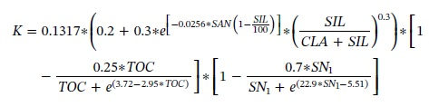
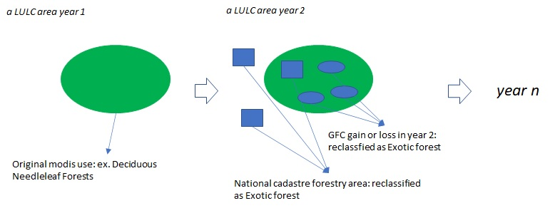
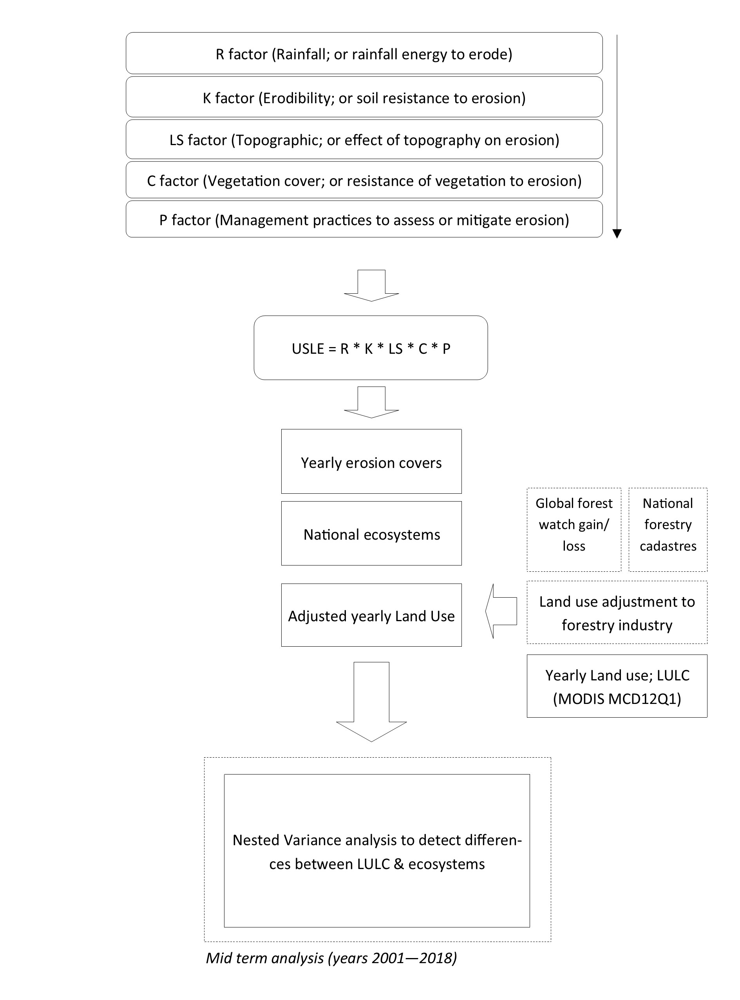

```{r setup, echo=F,warning=F,include=F}
knitr::opts_chunk$set(echo = TRUE)
knitr::opts_chunk$set(fig.pos = "H", out.extra = "")

if(!require(pacman)){install.packages("pacman")}
pacman::p_load(tidyverse,purrr,kableExtra,ggpubr,rstatix,reshape,tinytex,float)


USLE_formacion<-read_csv("USLE_formacion.csv") %>% filter(FORMACION=="Bosque esclerofilo" | FORMACION=="Matorral esclerofilo")  
USLE_formacion$USO <- gsub("Built-in", "Built in", USLE_formacion$USO);unique(USLE_formacion$USO)


```

# Resumen

La degradación del suelo es un problema que compromete la seguridad alimentaria y a los ecosistemas a escala global, y es causado principalmente por malas prácticas y el deficiente manejo y cambio de uso de suelos.  Las regiones del mundo con mayores tasas de erosión se encuentran en África y Sudamérica, que son regiones que suelen destinar menos recursos a combatir la degradación de suelos. Es por esto, que en este estudio se propone la estimación de las tasas de erosión para Chile, mediante la aplicación de un modelo de cuantificación de la erosión del suelo basado en productos derivados de imágenes satelitales y percepción remota, para abarcar una ventana temporal de 18 años. Chile es un país sudamericano con una economía basada en la extracción de recursos naturales que presenta muy altos niveles de erosión nacional. Particularmente, se trabajará con dos ecosistemas iconicos asociados al bosque esclerófilo en Chile central, debido a que estos se encuentran muy presionados por el cambio de uso de suelos y además poseen altos niveles de endemismo.
  
  
  Palabras clave: Erosión de los suelos, USLE, cambio global, cambio de uso se suelos, desertificación, perdida de biodiversidad.
  
  
  
  
# Introducción

El suelo es considerado un legado biológico y un recurso no renovable a escala humana ya que toma cientos o miles de años en formarse [@doran1997defining; @doran2002soil]. Sin embargo, más del 30% de los suelos mundiales se encuentran severamente degradados, siendo la erosión la principal causa de degradación [montanarella2015status]. La degradación de los suelos no solo compromete la seguridad alimentaria sino también la integridad de los ecosistemas terrestres y las especies que los conforman [@keesstra2016significance; @karlen2015soil; @robinson2017soil]. 

Los últimos cálculos estiman que a nivel mundial los suelos se degradan a una tasa de 35.9Pg/yr-1 [@borrelli2017assessment] debido al manejo inadecuado y el cabmio de uso de suelo (LULCC), ligadas al reemplazo de vegetación nativa por suelos agrícolas, ganaderos, forestales, mineros y urbanos, con un costo aproximado de USD$ 400 billones, correspondientes a pérdidas equivalentes en productividad agrícola [@myers1984gaia; @pimentel1995environmental; @montanarella2015agricultural]. De continuar esta tendencia, se espera que para el año 2050, cerca del 90% de los suelos del mundo se encuentren degradados [@montanarella2015status], por lo que resulta urgente tomar medidas, no solo para identificar aquellas zonas más propensas a degradarse sino también para adoptar las medidas de manejo adecuadas para evitarlo, y a la vez para conservar los suelos como legado biológico.

Si bien el problema de degradación de suelos ocurre a nivel mundial, los problemas de erosión son aún más graves en regiones en vías de desarrollo como Latinoamérica, en donde prima una visión extractivista de los recursos naturales, que relaja la fiscalización y que ha favorecido la desigualdad social, incrementado la proliferación de actividades que aceleran el LULCC [@barahona2019beyond; @borrelli2017assessment; @miranda2017native]. En Latinoamérica, Chile es un caso extremadamente delicado, al menos la mitad de sus suelos están severamente erosionados, y en algunas regiones los niveles de erosión llegan a más del 75% de los suelos [@lagos1994erosion], lo cual ha sido empeorado por la presencia de la industria forestal [@miranda2017native]. 
Considerando que la zona Mediterránea de Chile haya sido declarada como hotspot mundial de biodiversidad por poseer altos niveles de endemismo, se suma que el nivel de degradación de los suelos bordea el 70% [@lagos1994erosion]. Debemos también considerar que la perdida de biodiversidad y ecosistemas conlleva también la degradación del suelo y su biodiversidad subterránea que es aun es poco conocida. 

Bajo este escenario, es que se propone la estimación de las tasas de erosión a mediano plazo, abarcando el periodo entre los años 2001 a 2018 en todo Chile, para a) determinar los usos de suelo mas influyentes relacionados a la pérdida de suelo en Chile y b) determinar los factores de erosión más vinculados a la pérdida de suelos en dicho periodo. Sin embargo, como este documento se refiere a un análisis preliminar se limitará a: buscar relaciones significativas entre los usos de suelo para dos ecosistemas representativos de Chile Central (Bosque y matorral esclerófilo).

  
# Metodología


Para estimar las tasas de erosión anual se trabajo con el modelo USLE de la USDA ([@wischmeier1978predicting]. Que se descompone como sigue:

A = R * K * LS * C * P (Ecuación 1)

Donde A corresponde a la tasa anual de erosión (ton/ha/yr), R a la erosividad de la lluvia (MJ / mm / ha), que equivale al poder erosivo de la lluvia por año [@bonilla2011rainfall], K a la erodabilidad del terreno (t / MJ / mm), que equivale a las propiedades fisicoquímicas del suelo a ser erosionado [@parveen2012integrated; @panagos2017global], LS al factor topográfico, que equivale a las propiedades topográficas [@panagos2015estimating], C a la fracción vegetal, que equivale a la cobertura vegetal que protege al suelo de la erosión [@borrelli2018step], y P a las practicas de manejo que son tomadas activamente para prevenir la erosión. 


- El factor R se calculó como sigue:

R = 0.028*P^1.534 (Ecuación 2)

Donde R corresponde al factor anual de erosividad, P a la precipitación anual, 0.028 y 1.534 a parámetros ajustados de precipitación para Chile. 

- El factor K se calculó siguiendo el modelo EPIC [@sharpley1990epic; @yang2018integrating] basándose en el contenido de carbono orgánico, arcilla, limo y arena como sigue:


```{r Fig1, fig.cap= "Ecuación 3",out.width = "240px", fig.align='center', echo=F,warning=F,include=T}

```

Donde SIL equivale al contenido de limo, CLA al contenido de arcilla, SAN al contenido de arena, TOC al carbono orgánico del suelo y SN1 = 1-SAN/100. 


- El factor LS se calculó a partir de SAGA-GIS, utilizando el método de [@desmet1996gis] especial para zonas con topografía compleja y se estima como sigue:

LS = (A + D^2)^m+1 – A^m+1) / (X^m * D^m+2 * 22.13^m) (Ecuación 4)

Donde A equivale a un modelo de acumulación de flujo o Flow accumulation, D al tamaño de píxel (250m), X = sin α + cos α, con α equivalente al ángulo de exposición de la pendiente o Aspect, y m = β / β +1, con β = (((sin Θ / 0.0896)) / ((0.56+3*(sin Θ)0.8)), siendo Θ equivalente a la pendiente o Slope en grados.

- El factor C fue estimado a partir de [@durigon2014ndvi] y fué estimado como sigue:

C = (-NDVI + 1) / 2 (Ecuación 5)

Donde NDVI corresponde al índice normalizado de vegetación, que provee una estimación de la cobertura vegetal por píxel. El cálculo de este índice se realizó a partir de los meses de verano (21 de diciembre al 20 de marzo), utilizando productos MODIS MOD13Q1 con una imagen cada 16 días ponderadas por su media para el periodo completo.

- El factor P no fue estimado, y se asumió un valor de 1, que corresponde a un escenario pesimista en el cual son se estarían tomando acciones activas para prevenir la degradación y erosión del suelo (basado en [@bonilla2011rainfall].

Se estimó una ecuación ULSE por año, entre los años 2001 a 2018. Las variables del factor R se utilizaron los productos grillados de CHELSA-CRUTS  [@karger2017climatologies] resampleados a 250m. Tanto las variables del factor LS como C fueron obtenidas a través de Google Earth Engine, una plataforma libre, para análisis estadístico y geoespacial [@gorelick2017google]. Los productos grillados del factor K (Arena, Limo y Arcilla) fueron obtenidos desde Soilgrids [@hengl2017soilgrids250m] mientras que el contenido de carbono orgánico fue obtenido por elaboración propia (Núñez-Hidalgo et al., in prep). Los factores fueron calculados directamente en R o mediante SAGA-GIS

Usos de suelo
Se obtuvieron los usos de suelo anuales entre los años 2001 a 2018, los cuales fueron extraídos y adaptados de MODIS MCD12Q1. Se adaptó y simplificó la simbología de la clasificación IGBP, incluyendo la huella de la industria forestal (detalle en Fig \@ref(fig:Fig2))

```{r Fig2, fig.cap= "Adecuación uso forestal",out.width = "360px", fig.align='center',echo=F,warning=F,include=T}

```

Análisis estadístico preliminar

Se calculó la media de 18 años de cada uno de los modelos USLE (ton/ha) por uso de suelo y ecosistema mediante estadísticas zonales implementadas mediante la librería raster de R. Como ecosistemas se utilizaron las formaciones vegetacionales de [@luebert2017sinopsis]. Se aplicó un análisis de varianza ANOVA anidado para buscar diferencias significativas entre los usos de suelo en dos de los ecosistemas de Chile central (Bosque esclerófilo versus matorral esclerófilo), considerando una prueba de posthoc de Tukey para poder identificar en donde estarían las diferencias significativas (para un resumen de la metodología revisar Fig \@ref(fig:Fig3).


```{r Fig3, fig.cap= "Resumen de la metodología",out.width = "240px", fig.align='center',echo=F,warning=F,include=T}

```
# Resultados

```{r ANOVA ,echo=F,warning=F,include=F} 
aov1<-aov(MEAN ~ USO/FORMACION,data=USLE_formacion);summary(aov1)
INLINE1<-USLE_formacion %>% group_by(FORMACION) %>% summarise("Erosión anual (ton/yr)"=sum(SUM))
INLINE2<-USLE_formacion %>% group_by(FORMACION) %>% summarise("erosion media anual (ton/ha/yr)"=mean(MEAN))

total <-sum(USLE_formacion$SUM) %>% round() %>% as.integer()


```


## Tasas de erosión por ecosistema

Se encontró que la tasa de erosión anual de ambos ecosistemas corresponde a `r total` ton/año, de las cuales el `r round((INLINE1[1,2]/total)*100)`% corresponde al Bosque esclerofilo y el `r round((INLINE1[2,2]/total)*100)`% al Matorral esclerofilo

```{r Tabla1, echo=F,warning=F,include=T,table.cap="Perdida media anual por ecosistema"}

INLINE1 %>% kable(caption = "Perdida media anual por ecosistema") %>% kable_styling(bootstrap_options = c("stripped","hover"),latex_options = "HOLD_position")

```

En adición, la tasa anual media de erosion del Bosque esclerofilo corresponde a `r INLINE2[1,2]%>% round(digits = 2)` ton/ha/año y a `r INLINE2[2,2]%>% round(digits = 2)` ton/ha/año para el Matorral esclerofilo (Valores netos en Tabla \@ref(tab:Tabla1)).

## Análisis estadístico

Los resultados del ANOVA anidado encontraron diferencias entre ambos ecosistemas, siendo los bosques exoticos y las areas cultivadas y de pastizales los usos de suelo con diferencias significativas entre ambos ecosistemas (véase Fig \@ref(fig:Fig4), Tabla \@ref(tab:Tabla2) y Tabla \@ref(tab:Tabla3)).

 


```{r Tabla2, echo=F,warning=F,include=T, table.cap= "Erosión media por ecosistema y uso de suelo"}
knitr::opts_chunk$set(fig.pos = "H", out.extra = "")

USLE_formacion %>% filter(USO=="Exotic forests" | USO == "Croplands / Grasslands") %>% group_by(FORMACION,USO) %>% summarise("Erosión media"=mean(MEAN)) %>% dplyr::arrange(USO) %>% kable(caption = "Erosión media por ecosistema y uso de suelo") %>% kable_styling(bootstrap_options = c("stripped","hover"))

```


```{r Tabla3, echo=F,warning=F,include=T, table.cap= "Relaciones significativas entre ecosistemas"}
knitr::opts_chunk$set(fig.pos = "H", out.extra = "")

ph2<-tukey_hsd (aov1,ordered=T) %>% filter(term=="USO:FORMACION",p.adj<=0.05) %>%
  select(group1,group2,p.adj,p.adj.signif)%>% 
  separate(group1,c("USO_G1","FORMACION_G1"),sep = ":") %>% 
  separate(group2,c("USO_G2","FORMACION_G2"),sep = ":") %>% 
  filter(USO_G1==USO_G2)

ph2 %>% kable(caption = "Relaciones significativas entre ecosistemas") %>% kable_styling(bootstrap_options = c("stripped","hover"),latex_options = "HOLD_position")

```


```{r Fig4,echo=F,warning=F,include=T, fig.align='center',fig.cap="Boxplots entre usos de suelo por ecosistemas"}

ggplot(USLE_formacion, aes(x=FORMACION, y=MEAN, fill=USO))+
  geom_boxplot(notch = F ,aes(fill=ColorCode))+
  theme(axis.text.x = element_text(angle = 10),legend.position="bottom")+
  scale_fill_identity("Uso de suelo",labels=unique(USLE_formacion$USO),breaks=unique(USLE_formacion$ColorCode),guide = "legend")+
  labs(x="",y="Erosión media (ton/ha-1/yr-1)")
```


# Discusión/Conclusión


Se pudo determinar que si bien la tasa total anual de erosion del Bosque esclerofilo es mayor a la del Matorral esclerofilo, no hay mayores diferencias en las tasas medias anuales. Finalmente, ambas tasas se encuentran bajo la tasa media de erosion mundial, que corresponde a 2.8 Mg/ha^-1 [@borrelli2017assessment].


Por otro lado, se encontraron diferencias significativas entre las tasas medias anuales de ambos ecosistemas, destacando entre todos los usos las zonas cultivadas con pastizales y las plantaciones forestales, los cuales son a la vez los principales usos de suelo causantes de la erosión en el mundo.


# Referencias
